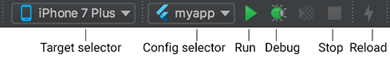
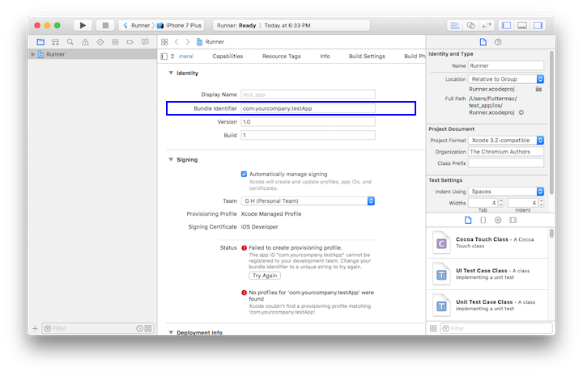

# 1.3 搭建 Flutter 开发环境

工欲善其事必先利其器，本节会分别介绍一下在 Windows 和 macOS 下 Flutter SDK 的安装，然后再介绍一下配合 IDE 和模拟器的使用。

## 1.3.1 安装 Flutter

由于 Flutter 会同时构建 Android 和 IOS 两个平台的发布包，所以 Flutter 同时依赖 Android SDK 和 iOS SDK，在安装 Flutter 时也需要安装相应平台的构建工具和 SDK。下面我们分别介绍一下 Windows 和 macOS 下的环境搭建。

> 注意：本节介绍的安装方式随着 Flutter 的升级可能会发生变化，如果下面介绍的内容在您安装 Flutter 时已经失效，请访问 Flutter 官网，按照官网最新的安装教程安装。

### 使用镜像

由于在国内访问 Flutter 有时可能会受到限制，Flutter 官方为中国开发者搭建了临时镜像，大家可以将如下环境变量加入到用户环境变量中：

```
export PUB_HOSTED_URL=https://pub.flutter-io.cn
export FLUTTER_STORAGE_BASE_URL=https://storage.flutter-io.cn
```

**注意：** 此镜像为临时镜像，并不能保证一直可用，读者可以参考https://flutter.io/community/china 以获得有关镜像服务器的最新动态。

### 在 Windows 上搭建 Flutter 开发环境

#### 系统要求

要安装并运行 Flutter，您的开发环境必须满足以下最低要求:

- 操作系统: Windows 7 或更高版本 (64-bit)

- 磁盘空间: 400 MB (不包括 Android Studio 的磁盘空间).

- 工具: Flutter 依赖下面这些命令行工具.

  - [PowerShell 5.0](https://docs.microsoft.com/en-us/powershell/scripting/setup/installing-windows-powershell#upgrading-existing-windows-powershell)  或更新的版本

  - [Git for Windows](https://git-scm.com/download/win)  (Git 命令行工具)；

  如果已安装 Git for Windows，请确保可以在命令提示符或 PowerShell 中运行 git 命令

#### 获取 Flutter SDK

1. 去 Flutter 官网下载其最新可用的安装包，下载地址：https://flutter.dev/docs/development/tools/sdk/releases ，打开后如图 1-2 所示：

   

注意，Flutter 的渠道版本会不停变动，请以 Flutter 官网为准。另外，在中国大陆地区，要想正常获取安装包列表或下载安装包，可能需要翻墙，读者也可以去 Flutter github 项目下去下载安装包，地址：https://github.com/flutter/flutter/releases

2. 将安装包 zip 解压到你想安装 Flutter SDK 的路径（如：`C:\src\flutter`；注意，**不要**将 Flutter 安装到需要一些高权限的路径如`C:\Program Files\`）。

3. 在 Flutter 安装目录的`flutter`文件下找到`flutter_console.bat`，双击运行并启动**flutter 命令行**，接下来，你就可以在 Flutter 命令行运行 flutter 命令了。

##### 更新环境变量

如果你想在 Windows 系统自带命令行运行 flutter 命令，需要添加以下环境变量到用户 PATH：

- 转到 “控制面板>用户帐户>用户帐户>更改我的环境变量”
- 在“用户变量”下检查是否有名为“Path”的条目:
  - 如果该条目存在， 追加 flutter\bin 的全路径，使用 ; 作为分隔符.
  - 如果该条目不存在，创建一个新用户变量 Path ，然后将 `flutter\bin` 的全路径作为它的值.

重启 Windows 以应用此更改.

##### 运行 flutter doctor 命令

在 Flutter 命令行运行如下命令来查看是否还需要安装其它依赖，如果需要，安装它们：

```shell
flutter doctor
```

该命令检查你的环境并在命令行窗口中显示报告。Dart SDK 已经在打包在 Flutter SDK 里了，没有必要单独安装 Dart。 仔细检查命令行输出以获取可能需要安装的其他软件或进一步需要执行的任务。

例如：

```
[-] Android toolchain - develop for Android devices
    • Android SDK at D:\Android\sdk
    ✗ Android SDK is missing command line tools; download from https://goo.gl/XxQghQ
    • Try re-installing or updating your Android SDK,
      visit https://flutter.io/setup/#android-setup for detailed instructions.
```

第一次运行 flutter 命令（如`flutter doctor`）时，它会下载它自己的依赖项并自行编译。以后再运行就会快得多。缺失的依赖需要安装一下，安装完成后再运行`flutter doctor`命令来验证是否安装成功。

#### Android 设置

Flutter 依赖于 Android Studio 的全量安装。Android Studio 不仅可以管理 Android 平台依赖、SDK 版本等，而且它也是 Flutter 开发推荐的 IDE 之一（当然，你也可以使用其它编辑器或 IDE，我们将会在后面讨论）。

##### 安装 Android Studio

1. 下载并安装 Android Studio，下载地址：https://developer.android.com/studio/index.html 。
2. 启动 Android Studio，然后执行“Android Studio 安装向导”。这将安装最新的 Android SDK、Android SDK 平台工具和 Android SDK 构建工具，这些是用 Flutter 进行 Android 开发所需要的。

#### 安装遇到问题？

如果在安装过程中遇到问题，可以先去 flutter 官网查看一下安装方式是否发生变化，或者在网上搜索一下解决方案。

### 在 macOS 上搭建 Flutter 开发环境

在 masOS 下可以同时进行 Android 和 iOS 设备的测试。

#### 系统要求

要安装并运行 Flutter，您的开发环境必须满足以下最低要求:

- 操作系统: macOS (64-bit)
- 磁盘空间: 700 MB (不包括 Xcode 或 Android Studio 的磁盘空间）.
- 工具: Flutter 依赖下面这些命令行工具.
  - `bash、mkdir、rm、git、curl、unzip、which`

#### 获取 Flutter SDK

1. 去 flutter 官网下载其最新可用的安装包，官网地址：https://flutter.io/sdk-archive/#macos

   注意，Flutter 的渠道版本会不停变动，请以 Flutter 官网为准。另外，在中国大陆地区，要想正常获取安装包列表或下载安装包，可能需要翻墙，读者也可以去 Flutter github 项目下去下载安装包，地址：https://github.com/flutter/flutter/releases 。

2. 解压安装包到你想安装的目录，如：

   ```shell
   cd ~/development
   unzip ~/Downloads/flutter_macos_v0.5.1-beta.zip
   ```

3. 添加`flutter`相关工具到 path 中：

   ```shell
   export PATH=`pwd`/flutter/bin:$PATH
   ```

   此代码只能暂时针对当前命令行窗口设置 PATH 环境变量，要想永久将 Flutter 添加到 PATH 中请参考下面**更新环境变量** 部分。

##### 运行 flutter doctor 命令

这一步和 Windows 下步骤一致，不再赘述。

##### 更新环境变量

将 Flutter 添加到 PATH 中，可以在任何终端会话中运行`flutter`命令。

对于所有终端会话永久修改此变量的步骤是和特定计算机系统相关的。通常，您会在打开新窗口时将设置环境变量的命令添加到执行的文件中。例如

1. 确定您 Flutter SDK 的目录记为“FLUTTER_INSTALL_PATH”，您将在步骤 3 中用到。

2. 打开(或创建) `$HOME/.bash_profile`。文件路径和文件名可能在你的电脑上不同.

3. 添加以下路径:

   ```shell
   export PATH=[FLUTTER_INSTALL_PATH]/flutter/bin:$PATH
   ```

   例如笔者 Flutter 安装目录是“~/code/flutter_dir”，那么代码为：

   ```
   export PATH=~/code/flutter_dir/flutter/bin:$PATH
   ```

4. 运行 `source $HOME/.bash_profile` 刷新当前终端窗口。

   > **注意:**  如果你使用终端是 zsh，终端启动时  `~/.bash_profile`  将不会被加载，解决办法就是修改  `～/.zshrc` ，在其中添加：source ～/.bash_profile

5. 验证“flutter/bin”是否已在 PATH 中：

   ```
   echo $PATH
   ```

#### 安装 Xcode

要为 iOS 开发 Flutter 应用程序，您需要 Xcode 9.0 或更高版本:

1. 安装 Xcode 9.0 或更新版本(通过[链接下载](https://developer.apple.com/xcode/)或[苹果应用商店](https://itunes.apple.com/us/app/xcode/id497799835)).
2. 配置 Xcode 命令行工具以使用新安装的 Xcode 版本 `sudo xcode-select --switch /Applications/Xcode.app/Contents/Developer` 对于大多数情况，当您想要使用最新版本的 Xcode 时，这是正确的路径。如果您需要使用不同的版本，请指定相应路径。
3. 确保 Xcode 许可协议是通过打开一次 Xcode 或通过命令`sudo xcodebuild -license`同意过了.

使用 Xcode，您可以在 iOS 设备或模拟器上运行 Flutter 应用程序。

#### 安装 Android Studio

和 Window 一样，要在 Android 设备上构建并运行 Flutter 程序都需要先安装 Android Studio，读者可以先自行下载并安装 Android Studio，在此不再赘述。

### 升级 Flutter

#### Flutter SDK 分支

Flutter SDK 有多个分支，如 beta、dev、master、stable，其中 stable 分支为稳定分支（日后有新的稳定版本发布后可能也会有新的稳定分支，如 1.0.0），dev 和 master 为开发分支，安装 flutter 后，你可以运行`flutter channel`查看所有分支，如笔者本地运行后，结果如下：

```
Flutter channels:
  beta
  dev
* master
```

带"\*"号的分支即你本地的 Flutter SDK 跟踪的分支，要切换分支，可以使用`flutter channel beta`  或  `flutter channel master`，Flutter 官方建议跟踪稳定分支，但你也可以跟踪`master`分支，这样可以查看最新的变化，但这样稳定性要低的多。

#### 升级 Flutter SDK 和依赖包

要升级 flutter sdk，只需一句命令：

```shell
flutter upgrade
```

该命令会同时更新 Flutter SDK 和你的 flutter 项目依赖包。如果你只想更新项目依赖包（不包括 Flutter SDK），可以使用如下命令：

- `flutter packages get`获取项目所有的依赖包。
- `flutter packages upgrade` 获取项目所有依赖包的最新版本。

####

## 1.3.2 IDE 配置与使用

理论上可以使用任何文本编辑器与命令行工具来构建 Flutter 应用程序。 不过，Flutter 官方建议使用 Android Studio 和 VS Code 之一以获得更好的开发体验。Flutter 官方提供了这两款编辑器插件，通过 IDE 和插件可获得代码补全、语法高亮、widget 编辑辅助、运行和调试支持等功能，可以帮助我们极大的提高开发效率。下面我们分别介绍一下 Android Studio 和 VS Code 的配置及使用（Android Studio 和 VS Code 读者可以在其官网获得最新的安装，由于安装比较简单，故不再赘述）。

### Android Studio 配置与使用

由于 Android Studio 是基于 IntelliJ IDEA 开发的，所以读者也可以使用 IntelliJ IDEA。

#### 安装 Flutter 和 Dart 插件

需要安装两个插件:

- `Flutter`插件： 支持 Flutter 开发工作流 (运行、调试、热重载等)。
- `Dart`插件： 提供代码分析 (输入代码时进行验证、代码补全等)。

安装步骤：

1. 启动 Android Studio。
2. 打开插件首选项 (macOS：**Preferences>Plugins**, Windows：**File>Settings>Plugins**)。
3. 选择 **Browse repositories…**，选择 flutter 插件并点击 `install`。
4. 重启 Android Studio 后插件生效。

接下来，让我们用 Android Studio 创建一个 Flutter 项目，然后运行它，并体验“热重载”。

#### 创建 Flutter 应用

1. 选择 **File>New Flutter Project** 。
2. 选择 **Flutter application** 作为 project 类型, 然后点击 Next。
3. 输入项目名称 (如 `myapp`)，然后点击 Next。
4. 点击 **Finish**。
5. 等待 Android Studio 安装 SDK 并创建项目。

上述命令创建一个 Flutter 项目，项目名为 myapp，其中包含一个使用[Material 组件](https://material.io/guidelines/)的简单演示应用程序。

在项目目录中，您应用程序的代码位于 `lib/main.dart`。

#### 运行应用程序

1. 定位到 Android Studio 工具栏，如图 1-3 所示：

   

2. 在 **target selector** 中, 选择一个运行该应用的 Android 设备。如果没有列出可用，请选择 **Tools>Android>AVD Manager** 并在那里创建一个。

3. 在工具栏中点击  **Run 图标**。

4. 如果一切正常, 您应该在您的设备或模拟器上会看到启动的应用程序：

   

#### 体验热重载

Flutter 可以通过 _热重载（hot reload）_ 实现快速的开发周期，热重载就是无需重启应用程序就能实时加载修改后的代码，并且不会丢失状态。简单的对代码进行更改，然后告诉 IDE 或命令行工具你需要重新加载（点击 reload 按钮），你就会在你的设备或模拟器上看到更改。

1. 打开`lib/main.dart`文件
2. 将字符串
   `'You have pushed the button this many times:'` 更改为
   `'You have clicked the button this many times:'`
3. 不要按“停止”按钮; 让您的应用继续运行.
4. 要查更改，请调用 **Save** (`cmd-s` / `ctrl-s`)，或者点击 **热重载按钮** (带有闪电 ⚡️ 图标的按钮)。

   你会立即在运行的应用程序中看到更新的字符串。

### VS Code 的配置与使用

VS Code 是一个轻量级编辑器，支持 Flutter 运行和调试。

#### 安装 flutter 插件

1. 启动 VS Code。
2. 调用 **View>Command Palette…**。
3. 输入 ‘install’, 然后选择 **Extensions: Install Extension** action。
4. 在搜索框输入 `flutter` ，在搜索结果列表中选择 ‘Flutter’, 然后点击 **Install**。
5. 选择 ‘OK’ 重新启动 VS Code。
6. 验证配置
   - 调用 **View>Command Palette…**
   - 输入 ‘doctor’, 然后选择 **‘Flutter: Run Flutter Doctor’** action。
   - 查看“OUTPUT”窗口中的输出是否有问题

#### 创建 Flutter 应用

1. 启动 VS Code
2. 调用 **View>Command Palette…**
3. 输入 ‘flutter’, 然后选择 **‘Flutter: New Project’** action
4. 输入 Project 名称 (如`myapp`), 然后按回车键
5. 指定放置项目的位置，然后按蓝色的确定按钮
6. 等待项目创建继续，并显示 main.dart 文件

#### 体验热重载

1. 打开`lib/main.dart`文件。
2. 将字符串
   `'You have pushed the button this many times:'` 更改为
   `'You have clicked the button this many times:'`。
3. 不要按“停止”按钮; 让您的应用继续运行。
4. 要查看您的更改，请调用 **Save** (`cmd-s` / `ctrl-s`), 或者点击 **热重载按钮** (绿色圆形箭头按钮)。

你会立即在运行的应用程序中看到更新的字符串。

## 1.3.3 连接设备运行 Flutter 应用

Window 下只支持为 Android 设备构建并运行 Flutter 应用，而 macOS 同时支持 iOS 和 Android 设备。下面分别介绍如何连接 Android 和 iOS 设备来运行 flutter 应用。

### 连接 Android 模拟器

要准备在 Android 模拟器上运行并测试 Flutter 应用，请按照以下步骤操作：

1. 启动 **Android Studio>Tools>Android>AVD Manager** 并选择 **Create Virtual Device**.

2. 选择一个设备并选择 **Next**。

3. 为要模拟的 Android 版本选择一个或多个系统印象，然后选择 **Next**. 建议使用 _x86_ 或 _x86_64_ image .

4. 在 “Emulated Performance”下, 选择 **Hardware - GLES 2.0** 以启用 [硬件加速](https://developer.android.com/studio/run/emulator-acceleration.html).

5. 验证 AVD 配置是否正确，然后选择 **Finish**。

   有关上述步骤的详细信息，请参阅 [Managing AVDs](https://developer.android.com/studio/run/managing-avds.html).

6. 在“Android Virtual Device Manager”中，点击工具栏的 **Run**。模拟器启动并显示所选操作系统版本或设备的启动画面。

7. 运行 `flutter run` 启动您的设备。 连接的设备名是 `Android SDK built for <platform>`，其中 _platform_ 是芯片系列，如 x86。

### 连接 Android 真机设备

要准备在 Android 设备上运行并测试 Flutter 应用，需要 Android 4.1（API level 16）或更高版本的 Android 设备.

1. 在 Android 设备上启用 **开发人员选项** 和 **USB 调试** 。详细说明可在[Android 文档](https://developer.android.com/studio/debug/dev-options.html)中找到。
2. 使用 USB 将手机插入电脑。如果设备出现调试授权提示，请授权你的电脑可以访问该设备。
3. 在命令行运行 `flutter devices` 命令以验证 Flutter 识别您连接的 Android 设备。
4. 运行启动你应用程序 `flutter run`。

默认情况下，Flutter 使用的 Android SDK 版本是基于你的 `adb` 工具版本。 如果想让 Flutter 使用不同版本的 Android SDK，则必须将该 `ANDROID_HOME` 环境变量设置为相应的 SDK 安装目录。

### 连接 iOS 模拟器

要准备在 iOS 模拟器上运行并测试 Flutter 应用，请按以下步骤操作：

1. 在你的 MAC 上，通过  Spotlight  或以下命令找到模拟器：

   ```shell
   open -a Simulator
   ```

2. 通过检查模拟器  **Hardware > Device**  菜单中的设置，确保模拟器正在使用 64 位设备（iPhone 5s 或更高版本）。

3. 根据你电脑屏幕大小，模拟高清屏 iOS 设备可能会溢出屏幕。可以在模拟器的 **Window> Scale** 菜单下设置设备比例。

4. 运行 `flutter run`启动 flutter 应用程序。

### 连接 iOS 真机设备

要将 Flutter 应用安装到 iOS 真机设备，需要一些额外的工具和一个 Apple 帐户，还需要在 Xcode 中进行一些设置。

1. 安装 [homebrew](http://brew.sh/) （如果已经安装了 brew,跳过此步骤）。

2. 打开终端并运行如下这些命令:

   ```shell
   brew update
   brew install --HEAD libimobiledevice
   brew install ideviceinstaller ios-deploy cocoapods
   pod setup
   ```

   如果这些命令中的任何一个失败并出现错误，请运行 brew doctor 并按照说明解决问题.

3. 遵循 Xcode 签名流程来配置您的项目:

   - 在你 Flutter 项目目录中通过  `open ios/Runner.xcworkspace`  打开默认的 Xcode workspace.

   - 在 Xcode 中，选择导航面板左侧中的`Runner`项目。

   - 在`Runner` target 设置页面中，确保在  **General > Signing > Team**  下选择了你的开发团队。当你选择一个团队时，Xcode 会创建并下载开发证书，向你的设备注册你的帐户，并创建和下载配置文件（如果需要）。

   - 要开始您的第一个 iOS 开发项目，您可能需要使用您的 Apple ID 登录 Xcode，如图 1-5：

     

     任何 Apple ID 都支持开发和测试，但若想将应用分发到 App Store，就必须注册 Apple 开发者计划，有关详情读者可以自行了解。

   4. 当您第一次 attach 真机设备进行 iOS 开发时，需要同时信任你的 Mac 和该设备上的开发证书。首次将 iOS 设备连接到 Mac 时，请在对话框中选择  `Trust`。

      

      然后，转到 iOS 设备上的**设置**菜单，选择  **常规>设备管理**  并信任您的证书。

   5. 如果 Xcode 中的自动签名失败，请验证项目的  **General > Identity > Bundle Identifier**  值是否唯一，如图 1-7 所示：

      

   6. 运行 `flutter run`启动 flutter 应用程序。

## 1.3.4 常见配置问题

### Android Studio 问题

#### 缺少依赖库问题

上手安卓最常遇见的问题之一，错误如图 1-8 所示，此时点击超链接即可自动跳转到安装页面


安装之后重新运行即可，如图 1-9：


#### 连接不上 Android Repository

这也是最常见的问题之一，当你发现自己无法下载部分依赖的时候，请优先考虑这种情况。进入 `File` -> `Settings` -> `Appearance & Behavior` -> `System Settings` -> `Android SDK` -> `SDK Update Sites` 列表，可以看到此时的 `Android Repository` 无法连接，如图 1-10 所示：


这是由于要去 Google 下载 Android SDK，但在国内目前无法访问 Google 所致，因此，我们可以配置代理或使用 vpn。

#### 安卓包配置问题

一般格式为

```
Could not HEAD **
Could not Get **
```

如：`Android Studio Could not GET gradle-3.2.0.pom`

这一类问题是由于无法连接到 Maven 库造成的，解决方法如下：

1. 进入`当前所在项目名/android`

2. 打开 `build.gradle`

3. 找到下面这一部分，并加上 `maven { url 'http://maven.aliyun.com/nexus/content/groups/public/' }`

   ```
   allprojects {
       repositories {
         google()
         jcenter()
         maven { url 'http://maven.aliyun.com/nexus/content/groups/public/' } //添加这一句
   	}
   }
   ```

4. 进入 File/ Settings/ Build, Execution, Deployment/ BuildTools/ Gradle/ Android Studio 中，勾选上 Enable embedded Maven repository ，重启 Android Studio 即可解决。

   > **注意：**存在这样的一种情况，当你根据上述步骤设置了之后，依旧无法解决这个问题，并有类似于 `Could not HEAD maven.aliyun.com` 的报错信息，请检查 `C:\Users\{user_name}\.gradle\gradle.properties` 是否有设置代理。删除后问题即可解决。

#### Hot Reload 热重载失效问题

在给 `Terminal` 之类的终端模拟器设置代理之后，会导致“Hot Reload”重载失效，此时调用 **Save** (`cmd-s` / `ctrl-s`)将不会进行热重载，**热重载按钮** (带有闪电 ⚡️ 图标的按钮)也不会显示，将代理移除即可解决。

另外，有些情况下热重载是不生效的，比如修改了`main`函数、修改了全局静态方法等，读者可以认为“Hot Reload”只会重新构建整个 widget 树，如果变动不在构建 widget 树的过程中，“Hot Reload”就不会起作用。
