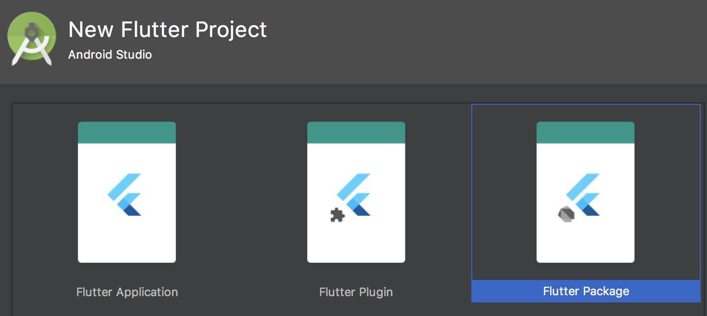

# Package

使用package可以创建共享的模块化代码。一个最小的package包括：

- 一个`pubspec.yaml`文件：声明了package的名称、版本、作者等的元数据文件。
- 一个 `lib` 文件夹：包括包中公开的(public)代码，最少应有一个`<package-name>.dart`文件


Flutter Packages分为两类：

- Dart包：其中一些可能包含Flutter的特定功能，因此对Flutter框架具有依赖性，这种包仅用于Flutter，例如[`fluro`](https://pub.dartlang.org/packages/fluro)包。
- 插件包：一种专用的Dart包，其中包含用Dart代码编写的API，以及针对Android（使用Java或Kotlin）和针对iOS（使用OC或Swift）平台的特定实现，也就是说插件包括原生代码，一个具体的例子是[`battery`](https://pub.dartlang.org/packages/battery)插件包。

注意，虽然Flutter的Dart运行时和Dart VM运行时不是完全相同，但是如果Package中没有涉及这些存在差异的部分，那么这样的包可以同时支持Flutter和Dart VM，如Dart http网络库[dio](https://github.com/flutterchina/dio). 


## 开发Dart包

### 第一步：创建Dart包

您可以通过Android Studio：File>New>New Flutter Project 来创建：



您也可以通过使用`--template=package` 来执行 `flutter create` 命令来创建：

```shell
flutter create --template=package hello
```

这将在`hello/`文件夹下创建一个具有以下专用内容的package工程：

- `lib/hello.dart`：Package的Dart代码

- `test/hello_test.dart`：Package的单元测试代码。

### 实现package

对于纯Dart包，只需在主`lib/<package name>.dart`文件内或`lib`目录中的文件中添加功能即可 。要测试软件包，请在`test`目录中添加[unit tests](https://flutter.io/testing/#unit-testing)。下面我们看看如何组织Package包的代码，我们以shelf Package为例，它的目录结构如下：


在lib根目录下的shelf.dart中，导出了多个lib/src目录下的dart文件：

```dart
export 'src/cascade.dart';
export 'src/handler.dart';
export 'src/handlers/logger.dart';
export 'src/hijack_exception.dart';
export 'src/middleware.dart';
export 'src/pipeline.dart';
export 'src/request.dart';
export 'src/response.dart';
export 'src/server.dart';
export 'src/server_handler.dart';
```

而Package中主要的功能的源码都在src目录下。shelf Package也导出了一个迷你库: shelf_io，它主要是处理HttpRequest的。

**导入包**

当需要使用这个Package时，我们可以通过"package:"指令来指定包的入口文件：

```dart
import 'package:utilities/utilities.dart';
```

同一个包中的源码文件之间也可以使用相对路径来导入。

### 生成文档

可以使用 [dartdoc](https://github.com/dart-lang/dartdoc#dartdoc) 工具来为Package生成文档，开发者需要做的就是遵守文档注释语法在代码中添加文档注释，最后使用dartdoc可以直接生成API文档（一个静态网站）。文档注释是使用三斜线"///"开始，如：

```dart
/// The event handler responsible for updating the badge in the UI.
void updateBadge() {
  ...
}
```

详细的文档语法请参考[dartdoc](https://github.com/dart-lang/dartdoc#dartdoc) 。

### 处理包的相互依赖

如果我们正在开发一个`hello`包，它依赖于另一个包，则需要将该依赖包添加到`pubspec.yaml`文件的`dependencies`部分。 下面的代码使`url_launcher`插件的API在`hello`包中是可用的：

在 `hello/pubspec.yaml`中:

```yaml
dependencies:
  url_launcher: ^0.4.2
```

现在可以在`hello`中`import 'package:url_launcher/url_launcher.dart'` 然后调用 `launch()`方法了。

这与在Flutter应用程序或任何其他Dart项目中引用软件包没有什么不同。

但是，如果`hello`碰巧是一个插件包，其平台特定的代码需要访问`url_launcher`公开的特定于平台的API，那么我们还需要为特定于平台的构建文件添加合适的依赖声明，如下所示。

**Android**

在 `hello/android/build.gradle`:

```groovy
android {
    // lines skipped
    dependencies {
        provided rootProject.findProject(":url_launcher")
    }
}
```

您现在可以在`hello/android/src`源码中`import io.flutter.plugins.urllauncher.UrlLauncherPlugin`访问`UrlLauncherPlugin`类。

**iOS**

在`hello/ios/hello.podspec`:

```ruby
Pod::Spec.new do |s|
  # lines skipped
  s.dependency 'url_launcher'
```

您现在可以在`hello/ios/Classes`源码中 `#import "UrlLauncherPlugin.h"` 然后访问 `UrlLauncherPlugin`类。

### 解决依赖冲突

假设我们想在我们的`hello`包中使用`some_package`和`other_package`，并且这两个包都依赖`url_launcher`，但是依赖的是`url_launcher`的不同的版本。 那我们就有潜在的冲突。避免这种情况的最好方法是在指定依赖关系时，程序包作者使用[版本范围](https://www.dartlang.org/tools/pub/dependencies#version-constraints)而不是特定版本。

```yaml
dependencies:
  url_launcher: ^0.4.2    # 这样会较好, 任何0.4.x(x >= 2)都可.
  image_picker: '0.1.1'   # 不是很好，只有0.1.1版本.
```

如果`some_package`声明了上面的依赖关系,`other_package`声明了`url_launcher`版本像’0.4.5’或’^0.4.0’，pub将能够自动解决问题。 

即使`some_package`和`other_package`声明了不兼容的`url_launcher`版本，它仍然可能会和`url_launcher`以兼容的方式正常工作。 你可以通过向`hello`包的`pubspec.yaml`文件中添加依赖性覆盖声明来处理冲突，从而强制使用特定版本：

强制使用 `0.4.3`版本的`url_launcher`，在 `hello/pubspec.yaml`中:

```yaml
dependencies:
  some_package:
  other_package:
dependency_overrides:
  url_launcher: '0.4.3'
```

如果冲突的依赖不是一个包，而是一个特定于Android的库，比如`guava`，那么必须将依赖重写声明添加到Gradle构建逻辑中。

强制使用`23.0`版本的`guava`库，在`hello/android/build.gradle`中：

```groovy
configurations.all {
    resolutionStrategy {
        force 'com.google.guava:guava:23.0-android'
    }
}
```

Cocoapods目前不提供依赖覆盖功能。

### 发布Package

一旦实现了一个包，我们可以在[Pub](https://pub.dartlang.org/)上发布它 ，这样其他开发者就可以轻松使用它。

在发布之前，检查`pubspec.yaml`、`README.md`以及`CHANGELOG.md`文件，以确保其内容的完整性和正确性。然后，运行 dry-run 命令以查看是否都准备OK了:

```shell
flutter packages pub publish --dry-run
```

验证无误后，我们就可以运行发布命令了：

```shell
flutter packages pub publish
```

> 如果你遇到包发布失败的情况，先检查是否因为众所周知的网络原因，如果是网络问题，可以使用VPN，这里需要注意的是一些代理只会代理部分APP的网络请求，如浏览器的，它们可能并不能代理dart的网络请求，所以在这种情况下，即使开了代理也依然无法连接到Pub，因此，在发布Pub包时使用全局代理或全局VPN会保险些。如果网络没有问题，以管理员权限(sudo)运行发布命令重试。

