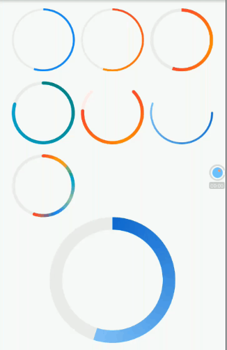

# 实例：圆形渐变进度条(自绘)

本节我们实现一个圆形渐变进度条，它支持：

1. 支持多种渐变色。
2. 任意弧度；整个进度可以不是整圆。
3. 可以自定义粗细、两端是否圆角等样式。

可以发现要实现这样的一个进度条是无法通过现有组件组合而成的，所以我们通过自绘方式实现。

实现代码如下：

```dart
import 'dart:math';
import 'package:flutter/material.dart';

class GradientCircularProgressIndicator extends StatelessWidget {
  GradientCircularProgressIndicator({
    this.stokeWidth = 2.0,
    @required this.radius,
    @required this.colors,
    this.stops,
    this.strokeCapRound = false,
    this.backgroundColor = const Color(0xFFEEEEEE),
    this.totalAngle = 2 * pi,
    this.value
  });

  ///粗细
  final double stokeWidth;

  /// 圆的半径
  final double radius;

  ///两端是否为圆角
  final bool strokeCapRound;

  /// 当前进度，取值范围 [0.0-1.0]
  final double value;

  /// 进度条背景色
  final Color backgroundColor;

  /// 进度条的总弧度，2*PI为整圆，小于2*PI则不是整圆
  final double totalAngle;

  /// 渐变色数组
  final List<Color> colors;

  /// 渐变色的终止点，对应colors属性
  final List<double> stops;

  @override
  Widget build(BuildContext context) {
    double _offset = .0;
    // 如果两端为圆角，则需要对起始位置进行调整，否则圆角部分会偏离起始位置
    // 下面调整的角度的计算公式是通过数学几何知识得出，读者有兴趣可以研究一下为什么是这样  
    if (strokeCapRound) {
      _offset = asin(stokeWidth / (radius * 2 - stokeWidth));
    }
    var _colors = colors;
    if (_colors == null) {
      Color color = Theme
          .of(context)
          .accentColor;
      _colors = [color, color];
    }
    return Transform.rotate(
      angle: -pi / 2.0 - _offset, 
      child: CustomPaint(
          size: Size.fromRadius(radius),
          painter: _GradientCircularProgressPainter(
            stokeWidth: stokeWidth,
            strokeCapRound: strokeCapRound,
            backgroundColor: backgroundColor,
            value: value,
            total: totalAngle,
            radius: radius,
            colors: _colors,
          )
      ),
    );
  }
}

//实现画笔
class _GradientCircularProgressPainter extends CustomPainter {
  _GradientCircularProgressPainter({
    this.stokeWidth: 10.0,
    this.strokeCapRound: false,
    this.backgroundColor = const Color(0xFFEEEEEE),
    this.radius,
    this.total = 2 * pi,
    @required this.colors,
    this.stops,
    this.value
  });

  final double stokeWidth;
  final bool strokeCapRound;
  final double value;
  final Color backgroundColor;
  final List<Color> colors;
  final double total;
  final double radius;
  final List<double> stops;

  @override
  void paint(Canvas canvas, Size size) {
    if (radius != null) {
      size = Size.fromRadius(radius);
    }
    double _offset = stokeWidth / 2.0;
    double _value = (value ?? .0);
    _value = _value.clamp(.0, 1.0) * total;
    double _start = .0;

    if (strokeCapRound) {
      _start = asin(stokeWidth/ (size.width - stokeWidth));
    }

    Rect rect = Offset(_offset, _offset) & Size(
        size.width - stokeWidth,
        size.height - stokeWidth
    );

    var paint = Paint()
      ..strokeCap = strokeCapRound ? StrokeCap.round : StrokeCap.butt
      ..style = PaintingStyle.stroke
      ..isAntiAlias = true
      ..strokeWidth = stokeWidth;

    // 先画背景
    if (backgroundColor != Colors.transparent) {
      paint.color = backgroundColor;
      canvas.drawArc(
          rect,
          _start,
          total,
          false,
          paint
      );
    }

    // 再画前景，应用渐变
    if (_value > 0) {
      paint.shader = SweepGradient(
        startAngle: 0.0,
        endAngle: _value,
        colors: colors,
        stops: stops,
      ).createShader(rect);

      canvas.drawArc(
          rect,
          _start,
          _value,
          false,
          paint
      );
    }
  }

  @override
  bool shouldRepaint(CustomPainter oldDelegate) => true;

}
```

下面我们来测试一下，为了尽可能多的展示GradientCircularProgressIndicator的不同外观和用途，这个示例代码会比较长，并且添加了动画，建议读者将此示例运行起来观看实际效果，我们先看看其中的一帧动画的截图：



完整的代码：

```dart
import 'dart:math';
import 'package:flutter/material.dart';
import '../widgets/index.dart';

class GradientCircularProgressRoute extends StatefulWidget {
  @override
  GradientCircularProgressRouteState createState() {
    return new GradientCircularProgressRouteState();
  }
}

class GradientCircularProgressRouteState
    extends State<GradientCircularProgressRoute> with TickerProviderStateMixin {
  AnimationController _animationController;

  @override
  void initState() {
    super.initState();
    _animationController =
        new AnimationController(vsync: this, duration: Duration(seconds: 3));
    bool isForward = true;
    _animationController.addStatusListener((status) {
      if (status == AnimationStatus.forward) {
        isForward = true;
      } else if (status == AnimationStatus.completed ||
          status == AnimationStatus.dismissed) {
        if (isForward) {
          _animationController.reverse();
        } else {
          _animationController.forward();
        }
      } else if (status == AnimationStatus.reverse) {
        isForward = false;
      }
    });
    _animationController.forward();
  }

  @override
  void dispose() {
    _animationController.dispose();
    super.dispose();
  }

  @override
  Widget build(BuildContext context) {
    return SingleChildScrollView(
      child: Center(
        child: Column(
          crossAxisAlignment: CrossAxisAlignment.center,
          children: <Widget>[
            AnimatedBuilder(
              animation: _animationController,
              builder: (BuildContext context, Widget child) {
                return Padding(
                  padding: const EdgeInsets.symmetric(vertical: 16.0),
                  child: Column(
                    children: <Widget>[
                      Wrap(
                        spacing: 10.0,
                        runSpacing: 16.0,
                        children: <Widget>[
                          GradientCircularProgressIndicator(
                            // No gradient
                            colors: [Colors.blue, Colors.blue],
                            radius: 50.0,
                            stokeWidth: 3.0,
                            value: _animationController.value,
                          ),
                          GradientCircularProgressIndicator(
                            colors: [Colors.red, Colors.orange],
                            radius: 50.0,
                            stokeWidth: 3.0,
                            value: _animationController.value,
                          ),
                          GradientCircularProgressIndicator(
                            colors: [Colors.red, Colors.orange, Colors.red],
                            radius: 50.0,
                            stokeWidth: 5.0,
                            value: _animationController.value,
                          ),
                          GradientCircularProgressIndicator(
                            colors: [Colors.teal, Colors.cyan],
                            radius: 50.0,
                            stokeWidth: 5.0,
                            strokeCapRound: true,
                            value: CurvedAnimation(
                                    parent: _animationController,
                                    curve: Curves.decelerate)
                                .value,
                          ),
                          TurnBox(
                            turns: 1 / 8,
                            child: GradientCircularProgressIndicator(
                                colors: [Colors.red, Colors.orange, Colors.red],
                                radius: 50.0,
                                stokeWidth: 5.0,
                                strokeCapRound: true,
                                backgroundColor: Colors.red[50],
                                totalAngle: 1.5 * pi,
                                value: CurvedAnimation(
                                        parent: _animationController,
                                        curve: Curves.ease)
                                    .value),
                          ),
                          RotatedBox(
                            quarterTurns: 1,
                            child: GradientCircularProgressIndicator(
                                colors: [Colors.blue[700], Colors.blue[200]],
                                radius: 50.0,
                                stokeWidth: 3.0,
                                strokeCapRound: true,
                                backgroundColor: Colors.transparent,
                                value: _animationController.value),
                          ),
                          GradientCircularProgressIndicator(
                            colors: [
                              Colors.red,
                              Colors.amber,
                              Colors.cyan,
                              Colors.green[200],
                              Colors.blue,
                              Colors.red
                            ],
                            radius: 50.0,
                            stokeWidth: 5.0,
                            strokeCapRound: true,
                            value: _animationController.value,
                          ),
                        ],
                      ),
                      GradientCircularProgressIndicator(
                        colors: [Colors.blue[700], Colors.blue[200]],
                        radius: 100.0,
                        stokeWidth: 20.0,
                        value: _animationController.value,
                      ),

                      Padding(
                        padding: const EdgeInsets.symmetric(vertical: 16.0),
                        child: GradientCircularProgressIndicator(
                          colors: [Colors.blue[700], Colors.blue[300]],
                          radius: 100.0,
                          stokeWidth: 20.0,
                          value: _animationController.value,
                          strokeCapRound: true,
                        ),
                      ),
                      //剪裁半圆
                      ClipRect(
                        child: Align(
                          alignment: Alignment.topCenter,
                          heightFactor: .5,
                          child: Padding(
                            padding: const EdgeInsets.only(bottom: 8.0),
                            child: SizedBox(
                              //width: 100.0,
                              child: TurnBox(
                                turns: .75,
                                child: GradientCircularProgressIndicator(
                                  colors: [Colors.teal, Colors.cyan[500]],
                                  radius: 100.0,
                                  stokeWidth: 8.0,
                                  value: _animationController.value,
                                  totalAngle: pi,
                                  strokeCapRound: true,
                                ),
                              ),
                            ),
                          ),
                        ),
                      ),
                      SizedBox(
                        height: 104.0,
                        width: 200.0,
                        child: Stack(
                          alignment: Alignment.center,
                          children: <Widget>[
                            Positioned(
                              height: 200.0,
                              top: .0,
                              child: TurnBox(
                                turns: .75,
                                child: GradientCircularProgressIndicator(
                                  colors: [Colors.teal, Colors.cyan[500]],
                                  radius: 100.0,
                                  stokeWidth: 8.0,
                                  value: _animationController.value,
                                  totalAngle: pi,
                                  strokeCapRound: true,
                                ),
                              ),
                            ),
                            Padding(
                              padding: const EdgeInsets.only(top: 10.0),
                              child: Text(
                                "${(_animationController.value * 100).toInt()}%",
                                style: TextStyle(
                                  fontSize: 25.0,
                                  color: Colors.blueGrey,
                                ),
                              ),
                            )
                          ],
                        ),
                      ),
                    ],
                  ),
                );
              },
            ),
          ],
        ),
      ),
    );
  }
}
```

