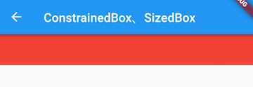

# 5.2 尺寸限制类容器

尺寸限制类容器用于限制容器大小，Flutter中提供了多种这样的容器，如`ConstrainedBox`、`SizedBox`、`UnconstrainedBox`、`AspectRatio`等，本节将介绍一些常用的。

## 5.2.1 ConstrainedBox

`ConstrainedBox`用于对子组件添加额外的约束。例如，如果你想让子组件的最小高度是80像素，你可以使用`const BoxConstraints(minHeight: 80.0)`作为子组件的约束。

#### 示例

我们先定义一个`redBox`，它是一个背景颜色为红色的盒子，不指定它的宽度和高度：

```dart
Widget redBox=DecoratedBox(
  decoration: BoxDecoration(color: Colors.red),
);
```

我们实现一个最小高度为50，宽度尽可能大的红色容器。

```dart
ConstrainedBox(
  constraints: BoxConstraints(
    minWidth: double.infinity, //宽度尽可能大
    minHeight: 50.0 //最小高度为50像素
  ),
  child: Container(
      height: 5.0, 
      child: redBox 
  ),
)
```

运行效果如图5-2所示：



可以看到，我们虽然将Container的高度设置为5像素，但是最终却是50像素，这正是ConstrainedBox的最小高度限制生效了。如果将Container的高度设置为80像素，那么最终红色区域的高度也会是80像素，因为在此示例中，ConstrainedBox只限制了最小高度，并未限制最大高度。

#### BoxConstraints

BoxConstraints用于设置限制条件，它的定义如下：

```dart
const BoxConstraints({
  this.minWidth = 0.0, //最小宽度
  this.maxWidth = double.infinity, //最大宽度
  this.minHeight = 0.0, //最小高度
  this.maxHeight = double.infinity //最大高度
})
```

BoxConstraints还定义了一些便捷的构造函数，用于快速生成特定限制规则的BoxConstraints，如`BoxConstraints.tight(Size size)`，它可以生成给定大小的限制；`const BoxConstraints.expand()`可以生成一个尽可能大的用以填充另一个容器的BoxConstraints。除此之外还有一些其它的便捷函数，读者可以查看[API文档](https://docs.flutter.io/flutter/rendering/BoxConstraints-class.html)。

## 5.2.2 SizedBox

`SizedBox`用于给子元素指定固定的宽高，如：

```dart
SizedBox(
  width: 80.0,
  height: 80.0,
  child: redBox
)
```
运行效果如图5-3所示：


实际上`SizedBox`只是`ConstrainedBox`的一个定制，上面代码等价于：


```dart
ConstrainedBox(
  constraints: BoxConstraints.tightFor(width: 80.0,height: 80.0),
  child: redBox, 
)
```

而`BoxConstraints.tightFor(width: 80.0,height: 80.0)`等价于：

```dart
BoxConstraints(minHeight: 80.0,maxHeight: 80.0,minWidth: 80.0,maxWidth: 80.0)
```

而实际上`ConstrainedBox`和`SizedBox`都是通过`RenderConstrainedBox`来渲染的，我们可以看到`ConstrainedBox`和`SizedBox`的`createRenderObject()`方法都返回的是一个`RenderConstrainedBox`对象：

```dart
@override
RenderConstrainedBox createRenderObject(BuildContext context) {
  return new RenderConstrainedBox(
    additionalConstraints: ...,
  );
}
```


## 5.2.3 多重限制

如果某一个组件有多个父级`ConstrainedBox`限制，那么最终会是哪个生效？我们看一个例子：

```dart
ConstrainedBox(
    constraints: BoxConstraints(minWidth: 60.0, minHeight: 60.0), //父
    child: ConstrainedBox(
      constraints: BoxConstraints(minWidth: 90.0, minHeight: 20.0),//子
      child: redBox,
    )
)
```

上面我们有父子两个`ConstrainedBox`，他们的限制条件不同，运行后效果如图5-4所示：


最终显示效果是宽90，高60，也就是说是子`ConstrainedBox`的`minWidth`生效，而`minHeight`是父`ConstrainedBox`生效。单凭这个例子，我们还总结不出什么规律，我们将上例中父子限制条件换一下：

```dart
ConstrainedBox(
    constraints: BoxConstraints(minWidth: 90.0, minHeight: 20.0),
    child: ConstrainedBox(
      constraints: BoxConstraints(minWidth: 60.0, minHeight: 60.0),
      child: redBox,
    )
)
```

运行效果如图5-5所示：


最终的显示效果仍然是90，高60，效果相同，但意义不同，因为此时`minWidth`生效的是父`ConstrainedBox`，而`minHeight`是子`ConstrainedBox`生效。

通过上面示例，我们发现有多重限制时，对于`minWidth`和`minHeight`来说，是取父子中相应数值较大的。实际上，只有这样才能保证父限制与子限制不冲突。

> 思考题：对于`maxWidth`和`maxHeight`，多重限制的策略是什么样的呢？


## 5.2.4 UnconstrainedBox

`UnconstrainedBox`不会对子组件产生任何限制，它允许其子组件按照其本身大小绘制。一般情况下，我们会很少直接使用此组件，但在"去除"多重限制的时候也许会有帮助，我们看下下面的代码：

```dart
ConstrainedBox(
    constraints: BoxConstraints(minWidth: 60.0, minHeight: 100.0),  //父
    child: UnconstrainedBox( //“去除”父级限制
      child: ConstrainedBox(
        constraints: BoxConstraints(minWidth: 90.0, minHeight: 20.0),//子
        child: redBox,
      ),
    )
)
```

上面代码中，如果没有中间的`UnconstrainedBox`，那么根据上面所述的多重限制规则，那么最终将显示一个90×100的红色框。但是由于` UnconstrainedBox` “去除”了父`ConstrainedBox`的限制，则最终会按照子`ConstrainedBox`的限制来绘制`redBox`，即90×20：


但是，读者请注意，`UnconstrainedBox`对父组件限制的“去除”并非是真正的去除：上面例子中虽然红色区域大小是90×20，但上方仍然有80的空白空间。也就是说父限制的`minHeight`(100.0)仍然是生效的，只不过它不影响最终子元素`redBox`的大小，但仍然还是占有相应的空间，可以认为此时的父`ConstrainedBox`是作用于子`UnconstrainedBox`上，而`redBox`只受子`ConstrainedBox`限制，这一点请读者务必注意。

那么有什么方法可以彻底去除父`ConstrainedBox`的限制吗？答案是否定的！所以在此提示读者，在定义一个通用的组件时，如果要对子组件指定限制，那么一定要注意，因为一旦指定限制条件，子组件如果要进行相关自定义大小时将可能非常困难，因为子组件在不更改父组件的代码的情况下无法彻底去除其限制条件。

在实际开发中，当我们发现已经使用`SizedBox`或`ConstrainedBox`给子元素指定了宽高，但是仍然没有效果时，几乎可以断定：已经有父元素已经设置了限制！举个例子，如Material组件库中的`AppBar`（导航栏）的右侧菜单中，我们使用`SizedBox`指定了loading按钮的大小，代码如下：

```dart
 AppBar(
   title: Text(title),
   actions: <Widget>[
         SizedBox(
             width: 20, 
             height: 20,
             child: CircularProgressIndicator(
                 strokeWidth: 3,
                 valueColor: AlwaysStoppedAnimation(Colors.white70),
             ),
         )
   ],
)
```

上面代码运行后，效果如图5-7所示：


我们会发现右侧loading按钮大小并没有发生变化！这正是因为`AppBar`中已经指定了`actions`按钮的限制条件，所以我们要自定义loading按钮大小，就必须通过`UnconstrainedBox`来“去除”父元素的限制，代码如下：

```dart
AppBar(
  title: Text(title),
  actions: <Widget>[
      UnconstrainedBox(
            child: SizedBox(
              width: 20,
              height: 20,
              child: CircularProgressIndicator(
                strokeWidth: 3,
                valueColor: AlwaysStoppedAnimation(Colors.white70),
              ),
          ),
      )
  ],
)
```

运行后效果如图5-8所示：


生效了！

## 5.2.4 其它尺寸限制类容器

除了上面介绍的这些常用的尺寸限制类容器外，还有一些其他的尺寸限制类容器，比如`AspectRatio`，它可以指定子组件的长宽比、`LimitedBox` 用于指定最大宽高、`FractionallySizedBox` 可以根据父容器宽高的百分比来设置子组件宽高等，由于这些容器使用起来都比较简单，我们便不再赘述，读者可以自行了解。