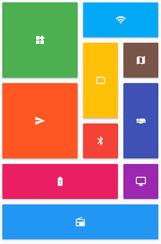

# 6.4 GridView

`GridView`可以构建一个二维网格列表，其默认构造函数定义如下：

```dart
GridView({
  Axis scrollDirection = Axis.vertical,
  bool reverse = false,
  ScrollController controller,
  bool primary,
  ScrollPhysics physics,
  bool shrinkWrap = false,
  EdgeInsetsGeometry padding,
  @required SliverGridDelegate gridDelegate, //控制子widget layout的委托
  bool addAutomaticKeepAlives = true,
  bool addRepaintBoundaries = true,
  double cacheExtent,
  List<Widget> children = const <Widget>[],
})
```

我们可以看到，`GridView`和`ListView`的大多数参数都是相同的，它们的含义也都相同的，如有疑惑读者可以翻阅ListView一节，在此不再赘述。我们唯一需要关注的是`gridDelegate`参数，类型是`SliverGridDelegate`，它的作用是控制`GridView`子组件如何排列(layout)。

`SliverGridDelegate`是一个抽象类，定义了`GridView` Layout相关接口，子类需要通过实现它们来实现具体的布局算法。Flutter中提供了两个`SliverGridDelegate`的子类`SliverGridDelegateWithFixedCrossAxisCount`和`SliverGridDelegateWithMaxCrossAxisExtent`，我们可以直接使用，下面我们分别来介绍一下它们。

### SliverGridDelegateWithFixedCrossAxisCount

该子类实现了一个横轴为固定数量子元素的layout算法，其构造函数为：

```dart
SliverGridDelegateWithFixedCrossAxisCount({
  @required double crossAxisCount, 
  double mainAxisSpacing = 0.0,
  double crossAxisSpacing = 0.0,
  double childAspectRatio = 1.0,
})
```

- `crossAxisCount`：横轴子元素的数量。此属性值确定后子元素在横轴的长度就确定了，即ViewPort横轴长度除以`crossAxisCount`的商。
- `mainAxisSpacing`：主轴方向的间距。
- `crossAxisSpacing`：横轴方向子元素的间距。
- `childAspectRatio`：子元素在横轴长度和主轴长度的比例。由于`crossAxisCount`指定后，子元素横轴长度就确定了，然后通过此参数值就可以确定子元素在主轴的长度。

可以发现，子元素的大小是通过`crossAxisCount`和`childAspectRatio`两个参数共同决定的。注意，这里的子元素指的是子组件的最大显示空间，注意确保子组件的实际大小不要超出子元素的空间。

下面看一个例子：

```dart
GridView(
  gridDelegate: SliverGridDelegateWithFixedCrossAxisCount(
      crossAxisCount: 3, //横轴三个子widget
      childAspectRatio: 1.0 //宽高比为1时，子widget
  ),
  children:<Widget>[
    Icon(Icons.ac_unit),
    Icon(Icons.airport_shuttle),
    Icon(Icons.all_inclusive),
    Icon(Icons.beach_access),
    Icon(Icons.cake),
    Icon(Icons.free_breakfast)
  ]
);
```


#### GridView.count

`GridView.count`构造函数内部使用了`SliverGridDelegateWithFixedCrossAxisCount`，我们通过它可以快速的创建横轴固定数量子元素的`GridView`，上面的示例代码等价于：

```dart
GridView.count( 
  crossAxisCount: 3,
  childAspectRatio: 1.0,
  children: <Widget>[
    Icon(Icons.ac_unit),
    Icon(Icons.airport_shuttle),
    Icon(Icons.all_inclusive),
    Icon(Icons.beach_access),
    Icon(Icons.cake),
    Icon(Icons.free_breakfast),
  ],
);
```


### SliverGridDelegateWithMaxCrossAxisExtent

该子类实现了一个横轴子元素为固定最大长度的layout算法，其构造函数为：

```dart
SliverGridDelegateWithMaxCrossAxisExtent({
  double maxCrossAxisExtent,
  double mainAxisSpacing = 0.0,
  double crossAxisSpacing = 0.0,
  double childAspectRatio = 1.0,
})
```

`maxCrossAxisExtent`为子元素在横轴上的最大长度，之所以是“最大”长度，是**因为横轴方向每个子元素的长度仍然是等分的**，举个例子，如果ViewPort的横轴长度是450，那么当`maxCrossAxisExtent`的值在区间[450/4，450/3)内的话，子元素最终实际长度都为112.5，而`childAspectRatio`所指的子元素横轴和主轴的长度比为**最终的长度比**。其它参数和`SliverGridDelegateWithFixedCrossAxisCount`相同。

下面我们看一个例子：

```dart
GridView(
  padding: EdgeInsets.zero,
  gridDelegate: SliverGridDelegateWithMaxCrossAxisExtent(
      maxCrossAxisExtent: 120.0,
      childAspectRatio: 2.0 //宽高比为2
  ),
  children: <Widget>[
    Icon(Icons.ac_unit),
    Icon(Icons.airport_shuttle),
    Icon(Icons.all_inclusive),
    Icon(Icons.beach_access),
    Icon(Icons.cake),
    Icon(Icons.free_breakfast),
  ],
);
```


#### GridView.extent

GridView.extent构造函数内部使用了SliverGridDelegateWithMaxCrossAxisExtent，我们通过它可以快速的创建纵轴子元素为固定最大长度的的GridView，上面的示例代码等价于：

```dart
GridView.extent(
   maxCrossAxisExtent: 120.0,
   childAspectRatio: 2.0,
   children: <Widget>[
     Icon(Icons.ac_unit),
     Icon(Icons.airport_shuttle),
     Icon(Icons.all_inclusive),
     Icon(Icons.beach_access),
     Icon(Icons.cake),
     Icon(Icons.free_breakfast),
   ],
 );
```


### GridView.builder

上面我们介绍的GridView都需要一个widget数组作为其子元素，这些方式都会提前将所有子widget都构建好，所以只适用于子widget数量比较少时，当子widget比较多时，我们可以通过`GridView.builder`来动态创建子widget。`GridView.builder` 必须指定的参数有两个：

```dart
GridView.builder(
 ...
 @required SliverGridDelegate gridDelegate, 
 @required IndexedWidgetBuilder itemBuilder,
)
```

其中`itemBuilder`为子widget构建器。

#### 示例

假设我们需要从一个异步数据源（如网络）分批获取一些`Icon`，然后用`GridView`来展示：

```dart
class InfiniteGridView extends StatefulWidget {
  @override
  _InfiniteGridViewState createState() => new _InfiniteGridViewState();
}

class _InfiniteGridViewState extends State<InfiniteGridView> {

  List<IconData> _icons = []; //保存Icon数据

  @override
  void initState() {
    // 初始化数据  
    _retrieveIcons();
  }

  @override
  Widget build(BuildContext context) {
    return GridView.builder(
        gridDelegate: SliverGridDelegateWithFixedCrossAxisCount(
            crossAxisCount: 3, //每行三列
            childAspectRatio: 1.0 //显示区域宽高相等
        ),
        itemCount: _icons.length,
        itemBuilder: (context, index) {
          //如果显示到最后一个并且Icon总数小于200时继续获取数据
          if (index == _icons.length - 1 && _icons.length < 200) {
            _retrieveIcons();
          }
          return Icon(_icons[index]);
        }
    );
  }

  //模拟异步获取数据
  void _retrieveIcons() {
    Future.delayed(Duration(milliseconds: 200)).then((e) {
      setState(() {
        _icons.addAll([
          Icons.ac_unit,
          Icons.airport_shuttle,
          Icons.all_inclusive,
          Icons.beach_access, Icons.cake,
          Icons.free_breakfast
        ]);
      });
    });
  }
}
```


- `_retrieveIcons()`：在此方法中我们通过`Future.delayed`来模拟从异步数据源获取数据，每次获取数据需要200毫秒，获取成功后将新数据添加到_icons，然后调用setState重新构建。
- 在itemBuilder中，如果显示到最后一个时，判断是否需要继续获取数据，然后返回一个Icon。

### 更多

Flutter的`GridView`默认子元素显示空间是相等的，但在实际开发中，你可能会遇到子元素大小不等的情况，如下面这样的布局：



Pub上有一个包“flutter_staggered_grid_view” ，它实现了一个交错GridView的布局模型，可以很轻松的实现这种布局，详情读者可以自行了解。

