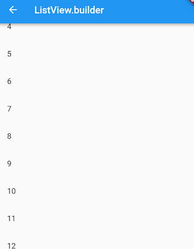

# 6.3 ListView

`ListView`是最常用的可滚动组件之一，它可以沿一个方向线性排布所有子组件，并且它也支持基于Sliver的延迟构建模型。我们看看ListView的默认构造函数定义：

```dart
ListView({
  ...  
  //可滚动widget公共参数
  Axis scrollDirection = Axis.vertical,
  bool reverse = false,
  ScrollController controller,
  bool primary,
  ScrollPhysics physics,
  EdgeInsetsGeometry padding,
  
  //ListView各个构造函数的共同参数  
  double itemExtent,
  bool shrinkWrap = false,
  bool addAutomaticKeepAlives = true,
  bool addRepaintBoundaries = true,
  double cacheExtent,
    
  //子widget列表
  List<Widget> children = const <Widget>[],
})
```

上面参数分为两组：第一组是可滚动组件的公共参数，本章第一节中已经介绍过，不再赘述；第二组是`ListView`各个构造函数（`ListView`有多个构造函数）的共同参数，我们重点来看看这些参数，：

- `itemExtent`：该参数如果不为`null`，则会强制`children`的“长度”为`itemExtent`的值；这里的“长度”是指滚动方向上子组件的长度，也就是说如果滚动方向是垂直方向，则`itemExtent`代表子组件的高度；如果滚动方向为水平方向，则`itemExtent`就代表子组件的宽度。在`ListView`中，指定`itemExtent`比让子组件自己决定自身长度会更高效，这是因为指定`itemExtent`后，滚动系统可以提前知道列表的长度，而无需每次构建子组件时都去再计算一下，尤其是在滚动位置频繁变化时（滚动系统需要频繁去计算列表高度）。
- `shrinkWrap`：该属性表示是否根据子组件的总长度来设置`ListView`的长度，默认值为`false` 。默认情况下，`ListView`的会在滚动方向尽可能多的占用空间。当`ListView`在一个无边界(滚动方向上)的容器中时，`shrinkWrap`必须为`true`。
- `addAutomaticKeepAlives`：该属性表示是否将列表项（子组件）包裹在`AutomaticKeepAlive` 组件中；典型地，在一个懒加载列表中，如果将列表项包裹在`AutomaticKeepAlive`中，在该列表项滑出视口时它也不会被GC（垃圾回收），它会使用`KeepAliveNotification`来保存其状态。如果列表项自己维护其`KeepAlive`状态，那么此参数必须置为`false`。
- `addRepaintBoundaries`：该属性表示是否将列表项（子组件）包裹在`RepaintBoundary`组件中。当可滚动组件滚动时，将列表项包裹在`RepaintBoundary`中可以避免列表项重绘，但是当列表项重绘的开销非常小（如一个颜色块，或者一个较短的文本）时，不添加`RepaintBoundary`反而会更高效。和`addAutomaticKeepAlive`一样，如果列表项自己维护其`KeepAlive`状态，那么此参数必须置为`false`。

> 注意：上面这些参数并非`ListView`特有，在本章后面介绍的其它可滚动组件也可能会拥有这些参数，它们的含义是相同的。

### 默认构造函数

默认构造函数有一个`children`参数，它接受一个Widget列表（List<Widget>）。这种方式适合只有少量的子组件的情况，因为这种方式需要将所有`children`都提前创建好（这需要做大量工作），而不是等到子widget真正显示的时候再创建，也就是说通过默认构造函数构建的ListView没有应用基于Sliver的懒加载模型。实际上通过此方式创建的`ListView`和使用`SingleChildScrollView`+`Column`的方式没有本质的区别。下面是一个例子：

```dart
ListView(
  shrinkWrap: true, 
  padding: const EdgeInsets.all(20.0),
  children: <Widget>[
    const Text('I\'m dedicating every day to you'),
    const Text('Domestic life was never quite my style'),
    const Text('When you smile, you knock me out, I fall apart'),
    const Text('And I thought I was so smart'),
  ],
);
```

> 再次强调，可滚动组件通过一个List<Widget>来作为其children属性时，只适用于子组件较少的情况，这是一个通用规律，并非`ListView`自己的特性，像`GridView`也是如此。

### ListView.builder

`ListView.builder`适合列表项比较多（或者无限）的情况，因为只有当子组件真正显示的时候才会被创建，也就说通过该构造函数创建的`ListView`是支持基于Sliver的懒加载模型的。下面看一下`ListView.builder`的核心参数列表：

```dart
ListView.builder({
  // ListView公共参数已省略  
  ...
  @required IndexedWidgetBuilder itemBuilder,
  int itemCount,
  ...
})
```

- `itemBuilder`：它是列表项的构建器，类型为`IndexedWidgetBuilder`，返回值为一个widget。当列表滚动到具体的`index`位置时，会调用该构建器构建列表项。
- `itemCount`：列表项的数量，如果为`null`，则为无限列表。

> 可滚动组件的构造函数如果需要一个列表项Builder，那么通过该构造函数构建的可滚动组件通常就是支持基于Sliver的懒加载模型的，反之则不支持，这是个一般规律。我们在后面在介绍可滚动组件的构造函数时将不再专门说明其是否支持基于Sliver的懒加载模型了。

下面看一个例子：

```dart
ListView.builder(
    itemCount: 100,
    itemExtent: 50.0, //强制高度为50.0
    itemBuilder: (BuildContext context, int index) {
      return ListTile(title: Text("$index"));
    }
);
```

运行效果如图6-2所示：




### ListView.separated

`ListView.separated`可以在生成的列表项之间添加一个分割组件，它比`ListView.builder`多了一个`separatorBuilder`参数，该参数是一个分割组件生成器。

下面我们看一个例子：奇数行添加一条蓝色下划线，偶数行添加一条绿色下划线。

```dart
class ListView3 extends StatelessWidget {
  @override
  Widget build(BuildContext context) {
    //下划线widget预定义以供复用。  
    Widget divider1=Divider(color: Colors.blue,);
    Widget divider2=Divider(color: Colors.green);
    return ListView.separated(
        itemCount: 100,
        //列表项构造器
        itemBuilder: (BuildContext context, int index) {
          return ListTile(title: Text("$index"));
        },
        //分割器构造器
        separatorBuilder: (BuildContext context, int index) {
          return index%2==0?divider1:divider2;
        },
    );
  }
}
```


### 实例：无限加载列表

假设我们要从数据源异步分批拉取一些数据，然后用`ListView`展示，当我们滑动到列表末尾时，判断是否需要再去拉取数据，如果是，则去拉取，拉取过程中在表尾显示一个loading，拉取成功后将数据插入列表；如果不需要再去拉取，则在表尾提示"没有更多"。代码如下：

```dart
class InfiniteListView extends StatefulWidget {
  @override
  _InfiniteListViewState createState() => new _InfiniteListViewState();
}

class _InfiniteListViewState extends State<InfiniteListView> {
  static const loadingTag = "##loading##"; //表尾标记
  var _words = <String>[loadingTag];

  @override
  void initState() {
    super.initState();
    _retrieveData();
  }

  @override
  Widget build(BuildContext context) {
    return ListView.separated(
      itemCount: _words.length,
      itemBuilder: (context, index) {
        //如果到了表尾
        if (_words[index] == loadingTag) {
          //不足100条，继续获取数据
          if (_words.length - 1 < 100) {
            //获取数据
            _retrieveData();
            //加载时显示loading
            return Container(
              padding: const EdgeInsets.all(16.0),
              alignment: Alignment.center,
              child: SizedBox(
                  width: 24.0,
                  height: 24.0,
                  child: CircularProgressIndicator(strokeWidth: 2.0)
              ),
            );
          } else {
            //已经加载了100条数据，不再获取数据。
            return Container(
                alignment: Alignment.center,
                padding: EdgeInsets.all(16.0),
                child: Text("没有更多了", style: TextStyle(color: Colors.grey),)
            );
          }
        }
        //显示单词列表项
        return ListTile(title: Text(_words[index]));
      },
      separatorBuilder: (context, index) => Divider(height: .0),
    );
  }

  void _retrieveData() {
    Future.delayed(Duration(seconds: 2)).then((e) {
      setState(() {
        //重新构建列表
		_words.insertAll(_words.length - 1,
          //每次生成20个单词
          generateWordPairs().take(20).map((e) => e.asPascalCase).toList()
      	);
      });
    });
  }

}
```

运行后效果如图6-4、6-5所示：


代码比较简单，读者可以参照代码中的注释理解，故不再赘述。需要说明的是，`_retrieveData()`的功能是模拟从数据源异步获取数据，我们使用english_words包的`generateWordPairs()`方法每次生成20个单词。

### 添加固定列表头

很多时候我们需要给列表添加一个固定表头，比如我们想实现一个商品列表，需要在列表顶部添加一个“商品列表”标题，期望的效果如图6-6所示：


我们按照之前经验，写出如下代码：

```dart
@override
Widget build(BuildContext context) {
  return Column(children: <Widget>[
    ListTile(title:Text("商品列表")),
    ListView.builder(itemBuilder: (BuildContext context, int index) {
        return ListTile(title: Text("$index"));
    }),
  ]);
}
```

然后运行，发现并没有出现我们期望的效果，相反触发了一个异常；

```
Error caught by rendering library, thrown during performResize()。
Vertical viewport was given unbounded height ...
```

从异常信息中我们可以看到是因为`ListView`高度边界无法确定引起，所以解决的办法也很明显，我们需要给`ListView`指定边界，我们通过`SizedBox`指定一个列表高度看看是否生效：

```dart
... //省略无关代码
SizedBox(
    height: 400, //指定列表高度为400
    child: ListView.builder(itemBuilder: (BuildContext context, int index) {
        return ListTile(title: Text("$index"));
    }),
),
...
```

运行效果如图6-7所示：


可以看到，现在没有触发异常并且列表已经显示出来了，但是我们的手机屏幕高度要大于400，所以底部会有一些空白。那如果我们要实现列表铺满除表头以外的屏幕空间应该怎么做？直观的方法是我们去动态计算，用屏幕高度减去状态栏、导航栏、表头的高度即为剩余屏幕高度，代码如下：

```dart
... //省略无关代码
SizedBox(
  //Material设计规范中状态栏、导航栏、ListTile高度分别为24、56、56 
  height: MediaQuery.of(context).size.height-24-56-56,
  child: ListView.builder(itemBuilder: (BuildContext context, int index) {
    return ListTile(title: Text("$index"));
  }),
)
...    
```

运行效果如下图6-8所示：


可以看到，我们期望的效果实现了，但是这种方法并不优雅，如果页面布局发生变化，比如表头布局调整导致表头高度改变，那么剩余空间的高度就得重新计算。那么有什么方法可以自动拉伸`ListView`以填充屏幕剩余空间的方法吗？当然有！答案就是`Flex`。前面已经介绍过在弹性布局中，可以使用`Expanded`自动拉伸组件大小，并且我们也说过`Column`是继承自`Flex`的，所以我们可以直接使用`Column`+`Expanded`来实现，代码如下：

```dart
@override
Widget build(BuildContext context) {
  return Column(children: <Widget>[
    ListTile(title:Text("商品列表")),
    Expanded(
      child: ListView.builder(itemBuilder: (BuildContext context, int index) {
        return ListTile(title: Text("$index"));
      }),
    ),
  ]);
}
```

运行后，和上图一样，完美实现了！

### 总结

本节主要介绍了`ListView`的一些公共参数以及常用的构造函数。不同的构造函数对应了不同的列表项生成模型，如果需要自定义列表项生成模型，可以通过`ListView.custom`来自定义，它需要实现一个`SliverChildDelegate`用来给ListView生成列表项组件，更多详情请参考API文档。

